# 🚀 Task Manager - Cloud-Native Platform with Multi-Tier Architecture

## 📖 Overview

Task Manager is a **complete cloud-native platform** demonstrating production-grade DevOps practices across multiple deployment scales. The project showcases infrastructure-as-code, GitOps continuous delivery, service mesh security, and intelligent auto-scaling.

### 🎯 Key Achievements

- ✅ **Multi-Tier Architecture**: Scale-based deployment strategies (Single-VM → Kubernetes)
- ✅ **4-Layer AKS Platform**: Cluster, Ingress, Monitoring, GitOps orchestration
- ✅ **GitOps CD Pipeline**: Pull-based deployments with ArgoCD (zero-credentials exposure)
- ✅ **Service Mesh Security**: Linkerd with automatic mTLS encryption
- ✅ **Intelligent Auto-Scaling**: HPA with ArgoCD reconciliation solution
- ✅ **5-Minute Deployments**: Complete CI/CD from code to production

---

## 🏗️ Architecture

### Multi-Scale Deployment Strategy
-----------------------------------------------------------------                                                          
│  │   < 10K      │   10K - 100K    │      > 100K               │
│  │   Users      │   Users         │      Users                │
│         ↓                ↓                    ↓                
│  ┌─────────────┐  ┌─────────────┐  ┌──────────────────────┐   │
│  │  TIER 1     │  │  TIER 2     │  │  TIER 3              │   │
│  │  Single VM  │  │  Load       │  │  Kubernetes          │   │
│  │             │  │  Balanced   │  │  Auto-Scaling        │   │
│  │  $25/month  │  │  $100/month │  │  $200+/month         │   │
│  └─────────────┘  └─────────────┘  └──────────────────────┘   │
└───────────────────────────────────────────────────────────────

### Tier 1: Single-VM Deployment (Cost-Optimized)

**Target**: Startups, MVPs, Development environments  
**Capacity**: < 10,000 users  
**Cost**: ~$25/month
┌────────────────────────────────────────────┐
│         Azure VM (Standard B2s)            │
├────────────────────────────────────────────┤
│                                             │
│  ┌──────────────────────────────────────┐  │
│  │   Docker Compose Stack               │  │
│  │  ┌────────────────────────────────┐  │  │
│  │  │  Nginx (Reverse Proxy + Serve frontend)    │  │  │
│  │  └────────────────────────────────┘  │  │
│  │  ┌────────────────────────────────┐  │  │
│  │  │  Backend (Node.js)             │  │  │
│  │  └────────────────────────────────┘  │  │
│  │  ┌────────────────────────────────┐  │  │
│  │  │  PostgreSQL + Redis            │  │  │
│  │  └────────────────────────────────┘  │  │
│  │  ┌────────────────────────────────┐  │  │
│  │  │  Prometheus + Grafana          │  │  │
│  │  └────────────────────────────────┘  │  │
│  └──────────────────────────────────────┘  │
│                                             │
│  Infrastructure: Terraform + Ansible        │
│  VNet: 10.0.0.0/16                         │
│  NSG: SSH (admin IP only), HTTP/HTTPS      │
└────────────────────────────────────────────┘

**Key Features**:
- Terraform-provisioned Azure VM with VNet isolation
- Ansible-managed OS configuration (idempotent playbooks)
- Docker Compose orchestration
- Built-in monitoring (Prometheus + Grafana)
- Azure NSG security rules

---

### Tier 3: Kubernetes Deployment (Production-Scale)

**Target**: Production workloads, High availability  
**Capacity**: 100,000+ users  
**Cost**: ~$200+/month (scales with load)
┌──────────────────────────────────────────────────────────────────┐
│                   Azure Kubernetes Service (AKS)                  │
├──────────────────────────────────────────────────────────────────┤
│                                                                   │
│  LAYER 1: Cluster Infrastructure (Terraform)                     │
│  ┌────────────────────────────────────────────────────────────┐  │
│  │  • AKS Cluster (3 nodes, auto-scaling 1-10)               │  │
│  │  • VNet + Subnets (10.1.0.0/16)                           │  │
│  │  • Network Security Groups                                │  │
│  │  • ArgoCD Bootstrap (on cluster init)                     │  │
│  └────────────────────────────────────────────────────────────┘  │
│                            ↓                                      │
│  LAYER 2: Ingress (Nginx Ingress Controller)                     │
│  ┌────────────────────────────────────────────────────────────┐  │
│  │  Routes:                                                   │  │
│  │    / → Frontend Service                                    │  │
│  │    /api → Backend Service                                  │  │
│  │    /health → Backend Health Check                          │  │
│  └────────────────────────────────────────────────────────────┘  │
│                            ↓                                      │
│  LAYER 3: Monitoring (kube-prometheus-stack)                      │
│  ┌────────────────────────────────────────────────────────────┐  │
│  │  • Prometheus Operator                                     │  │
│  │  • ServiceMonitor CRDs (app metrics)                       │  │
│  │  • Grafana Dashboards                                      │  │
│  │  • AlertManager                                            │  │
│  └────────────────────────────────────────────────────────────┘  │
│                            ↓                                      │
│  LAYER 4: GitOps (ArgoCD)                                         │
│  ┌────────────────────────────────────────────────────────────┐  │
│  │  App-of-Apps Pattern:                                      │  │
│  │    ├─ Root App (manages children)                          │  │
│  │    ├─ Linkerd Service Mesh App                             │  │
│  │    ├─ Backend App (watches manifests repo)                 │  │
│  │    └─ Frontend App (auto-sync on Git changes)              │  │
│  └────────────────────────────────────────────────────────────┘  │
│                            ↓                                      │
│  APPLICATION LAYER                                                │
│  ┌────────────────────────────────────────────────────────────┐  │
│  │  Deployments:                                              │  │
│  │    • Backend (2-10 replicas, HPA-managed)                  │  │
│  │    • Frontend (2-10 replicas, HPA-managed)                 │  │
│  │  StatefulSets:                                             │  │
│  │    • PostgreSQL (1 replica, PVC: 10Gi)                     │  │
│  │  Deployments:                                              │  │
│  │    • Redis (1 replica, PVC: 5Gi)                           │  │
│  │                                                             │  │
│  │  Service Mesh: Linkerd (mTLS, latency-aware LB)           │  │
│  └────────────────────────────────────────────────────────────┘  │
└──────────────────────────────────────────────────────────────────┘

---

## 🎯 Features

### Infrastructure as Code

- **Terraform Modules**: Reusable, modular design for multiple deployment tiers
- **Remote State Management**: Azure Blob Storage backend with state locking
- **Multi-Environment**: Dev, staging, production via Terraform workspaces
- **Network Isolation**: VNet/subnet segmentation with NSG firewall rules

### GitOps Continuous Delivery

```mermaid
graph LR
    A[Code Push] --> B[GitHub Actions CI]
    B --> C[Build & Test]
    C --> D[Docker Build]
    D --> E[Tag with SHA]
    E --> F[Push to Registry]
    F --> G[Update Manifests]
    G --> H[Push to Git]
    H --> I[ArgoCD Detects Change]
    I --> J[Auto-Sync Cluster]
    J --> K[✅ Deployed]
    
    style A fill:#e1f5ff
    style K fill:#d4edda
```



**Benefits**:
- ✅ **Zero-Credential Deployments**: No cluster credentials in CI pipeline
- ✅ **Git as Source of Truth**: All changes auditable via Git history
- ✅ **Drift Detection**: Automatic reconciliation if cluster state diverges
- ✅ **Easy Rollback**: `git revert` to previous working state
- ✅ **Multi-App Management**: App-of-Apps pattern for hierarchical deployments

### Service Mesh Security (Linkerd)
┌─────────────────────────────────────────────────────────┐
│  Pod: Backend                                            │
│  ┌─────────────┐  ┌──────────────────────────────────┐  │
│  │   App       │  │  Linkerd Proxy (Sidecar)         │  │
│  │  Container  │→ │  • mTLS Encryption               │  │
│  │             │  │  • Latency-aware Load Balancing  │  │
│  │             │  │  • Circuit Breakers              │  │
│  │             │  │  • Golden Metrics Collection     │  │
│  └─────────────┘  └──────────────────────────────────┘  │
└─────────────────────────────────────────────────────────┘
↓ Encrypted mTLS ↓
┌─────────────────────────────────────────────────────────┐
│  Pod: Frontend                                           │
│  ┌──────────────────────────────────┐  ┌─────────────┐  │
│  │  Linkerd Proxy (Sidecar)         │  │   App       │  │
│  │  • Decrypt mTLS                  │→ │  Container  │  │
│  │  • Request Retries               │  │             │  │
│  │  • Timeout Handling              │  │             │  │
│  └──────────────────────────────────┘  └─────────────┘  │
└─────────────────────────────────────────────────────────┘

**Features**:
- **Zero-Trust Networking**: Automatic mTLS between all services
- **Intelligent Load Balancing**: Latency-based routing (not round-robin)
- **Observability**: Golden metrics (success rate, RPS, P99 latency)
- **No Code Changes**: Transparent proxy injection

### Horizontal Pod Autoscaler with ArgoCD Reconciliation

**The Problem**:
ArgoCD: "Git says 4 replicas"
HPA: "I need 8 replicas for load!"
ArgoCD: "Drift detected! Rolling back to 4"
HPA: "Scaling back to 8!"
→ INFINITE LOOP! 🔄

**The Solution**:
```yaml
# Remove hardcoded replicas from manifest
spec:
  # replicas: 4  ← REMOVED
  
# ArgoCD Application - ignore replicas field
apiVersion: argoproj.io/v1alpha1
kind: Application
spec:
  ignoreDifferences:
  - group: apps
    kind: Deployment
    jsonPointers:
    - /spec/replicas
```

**Result**: HPA manages replicas dynamically, ArgoCD manages everything else. Perfect coexistence! ✅

---

## 🚀 Quick Start

### Prerequisites

- Azure account with active subscription
- Azure CLI installed and configured
- Terraform >= 1.5.0
- kubectl >= 1.28.0
- Docker & Docker Compose
- Ansible >= 2.15 (for VM tier)

### Deploy Tier 1 (Single-VM)

```bash
# 1. Clone repository
git clone https://github.com/chedli01/task_management_devops.git
cd task_management_devops

# 2. Initialize Terraform
cd terraform
./scripts/init.sh

# 3. Create terraform.tfvars
cat > terraform.tfvars << EOF
admin_source_ip = "YOUR_IP/32"
ssh_public_key_path = "~/.ssh/id_rsa.pub"
environment = "dev"
EOF

# 4. Deploy infrastructure
./scripts/apply.sh

# 5. Configure with Ansible
cd ../../../ansible
./scripts/get-inventory.sh
./scripts/deploy.sh latest

# 6. Access application
VM_IP=$(cd ../terraform/environments/single-vm && terraform output -raw vm_public_ip)
echo "Application: http://$VM_IP"
echo "Grafana: http://$VM_IP:3001"
```

### Deploy Tier 3 (Kubernetes)

```bash
# 1. Provision AKS cluster
cd terraform
./scripts-k8s/01-cluster/init.sh
./scripts-k8s/01-cluster/apply.sh

# 2. Get credentials
az aks get-credentials \
  --resource-group taskmanager-prod-k8s-rg \
  --name taskmanager-prod-k8s-cluster

# 3. Verify ArgoCD installation (auto-installed by Terraform)
kubectl get pods -n argocd

# 4. Access ArgoCD UI
kubectl port-forward svc/argocd-server -n argocd 8080:443

# 5. Deploy applications via ArgoCD
# Applications auto-sync from Git manifests repository
# Check ArgoCD UI at https://localhost:8080

# 6. Get application URL
kubectl get ingress -n task-manager-prod
```

---

## 📊 CI/CD Pipeline

### CI Workflow (GitHub Actions)

```yaml
name: CI - Build and Push

on:
  push:
    branches: [main]

jobs:
  build:
    runs-on: ubuntu-latest
    steps:
      - uses: actions/checkout@v4
      
      - name: Set image tag
        run: echo "IMAGE_TAG=${GITHUB_SHA::7}" >> $GITHUB_ENV
      
      - name: Build images
        run: |
          docker build -t chedli01/backend:$IMAGE_TAG ./backend
          docker build -t chedli01/frontend:$IMAGE_TAG ./frontend
      
      - name: Push to registry
        run: |
          docker push chedli01/backend:$IMAGE_TAG
          docker push chedli01/frontend:$IMAGE_TAG
      
      - name: Update manifests
        run: |
          cd k8s/overlays/prod
          kustomize edit set image backend=chedli01/backend:$IMAGE_TAG
          kustomize edit set image frontend=chedli01/frontend:$IMAGE_TAG
          git commit -am "Update images to $IMAGE_TAG"
          git push
```

### CD Workflow (ArgoCD - Pull-based)
Git Manifests Repository
↓
[Git Push Event]
↓
ArgoCD Watches
↓
Detects Change
↓
Compares Desired (Git) vs Actual (Cluster)
↓
Auto-Sync Enabled
↓
kubectl apply manifests
↓
✅ Cluster Updated

**No cluster credentials in CI!** 🔒

---

## 📈 Monitoring & Observability

### Prometheus Operator Stack

- **Prometheus**: Metrics collection with ServiceMonitor CRDs
- **Grafana**: Pre-configured dashboards for cluster, nodes, pods, applications
- **AlertManager**: Alert routing and notification
- **Node Exporter**: VM-level metrics
- **kube-state-metrics**: Kubernetes object state metrics

### Key Metrics Tracked

```yaml
# Application Metrics (via ServiceMonitor)
- http_requests_total
- http_request_duration_seconds
- http_requests_errors_total

# Cluster Metrics
- node_cpu_usage
- node_memory_usage
- pod_cpu_usage
- pod_memory_usage

# Service Mesh Metrics (Linkerd)
- success_rate
- requests_per_second
- latency_p99
```

### Grafana Dashboards

1. **Cluster Overview**: CPU, memory, disk usage across nodes
2. **Application Performance**: Request rate, latency, error rate
3. **Service Mesh**: mTLS status, route metrics, latency heatmaps
4. **Database Performance**: PostgreSQL connections, query time, locks

---

## 🔒 Security

### Network Security

- **Azure NSG**: Restrictive firewall rules (SSH admin-only, public HTTPS)
- **VNet Isolation**: Separate subnets for app, data, management
- **Service Mesh mTLS**: Encrypted service-to-service communication
- **Ingress TLS**: HTTPS termination at ingress controller

### Secrets Management

- **Kubernetes Secrets**: Base64-encoded secrets in cluster
- **Azure Key Vault**: External secrets via CSI driver integration
- **Ansible Vault**: Encrypted secrets in Ansible playbooks
- **No Hardcoded Credentials**: All sensitive data externalized

### Access Control

- **SSH Key Authentication**: Password auth disabled
- **Azure Managed Identity**: VM-to-Azure resource authentication
- **Kubernetes RBAC**: Role-based access control for cluster resources
- **ArgoCD SSO**: OIDC integration for user authentication

---

## 📁 Project Structure
task-manager/
├── terraform/
│   ├── modules/
│   │   ├── single-vm/          # Tier 1: VM infrastructure
│   │   └── kubernetes-cluster/                # Tier 3: Kubernetes cluster
│   └── environments/
│       ├── kubernetes-prod/
│       └── prod/
├── ansible/
│   ├── roles/
│   │   ├── docker/             # Docker installation
│   │   ├── application/        # App deployment
│   │   └── common/        
│   └── playbooks/
├── kubernetes/
│   ├── base/                   # Base Kustomize manifests
│   │   ├── backend/
│   │   ├── frontend/
│   │   ├── postgres/
│   │   └── redis/
│   ├── overlays/
│   │   ├── dev/                # Dev-specific configs
│   │   └── prod/               # Prod-specific configs
│   └── argocd/
│       └── root-apps/               # Child applications
├── monitoring/
│   ├── prometheus/
│   │   └── prometheus.yml
│   └── grafana/
│       ├── dashboards/
│       └── datasources/
├── .github/
│   └── workflows/
│       ├── ci.yml              # Build & push images
│       └── cd-vm.yml           # Deploy to VM tier


---

## 🛠️ Technologies

### Infrastructure & Cloud
- **Terraform** - Infrastructure as Code
- **Ansible** - Configuration Management
- **Azure** - Cloud Platform (AKS, VNet, NSG, Key Vault)
- **Kubernetes** - Container Orchestration

### GitOps & CI/CD
- **ArgoCD** - GitOps Continuous Delivery
- **GitHub Actions** - CI Pipeline
- **Kustomize** - Kubernetes Manifest Management
- **Helm** - Package Manager (kube-prometheus-stack, Linkerd)

### Observability
- **Prometheus** - Metrics Collection
- **Grafana** - Visualization & Dashboards
- **Linkerd Viz** - Service Mesh Observability

### Security & Networking
- **Linkerd** - Service Mesh with mTLS
- **Nginx Ingress** - Ingress Controller
- **Azure NSG** - Network Security Groups

### Application Stack
- **Docker** - Containerization
- **Node.js** - Backend Runtime
- **PostgreSQL** - Primary Database
- **Redis** - Caching Layer

---

## 📊 Performance Metrics

### Deployment Speed
- **Initial Infrastructure Provision**: ~15 minutes (Terraform + Ansible)
- **Code to Production (VM Tier)**: ~5 minutes
- **Code to Production (K8s Tier)**: ~3 minutes (GitOps)
- **Rollback Time**: <1 minute (git revert + ArgoCD sync)

### Cost Optimization
- **Single-VM Tier**: $25/month (< 10K users)
- **Kubernetes Tier**: $200+/month (100K+ users, scales with load)
- **Cost Savings**: 88% for low-traffic workloads by right-sizing infrastructure

### Scalability
- **HPA Response Time**: < 30 seconds from load spike to scaled pods
- **Zero-Downtime Deployments**: Rolling updates with readiness probes
- **Auto-Scaling Range**: 2-10 replicas (configurable)

---

## 🎓 Learning Outcomes

This project demonstrates:

✅ **Production-Ready Infrastructure**: Not a toy project 
✅ **GitOps Best Practices**: Pull-based CD with zero cluster credentials in CI  
✅ **Service Mesh Expertise**: Zero-trust networking with transparent mTLS  
✅ **Problem-Solving Skills**: Solved ArgoCD-HPA conflict (rare advanced pattern)  
✅ **Cost-Conscious Design**: Multi-tier architecture optimizes spend vs. scale  
✅ **Security-First Mindset**: Defense in depth (NSG, mTLS, secrets management)  
✅ **Observability Culture**: Golden metrics, custom dashboards, alerting  

---
